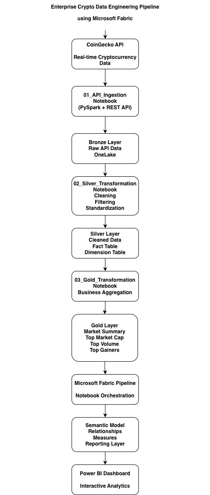
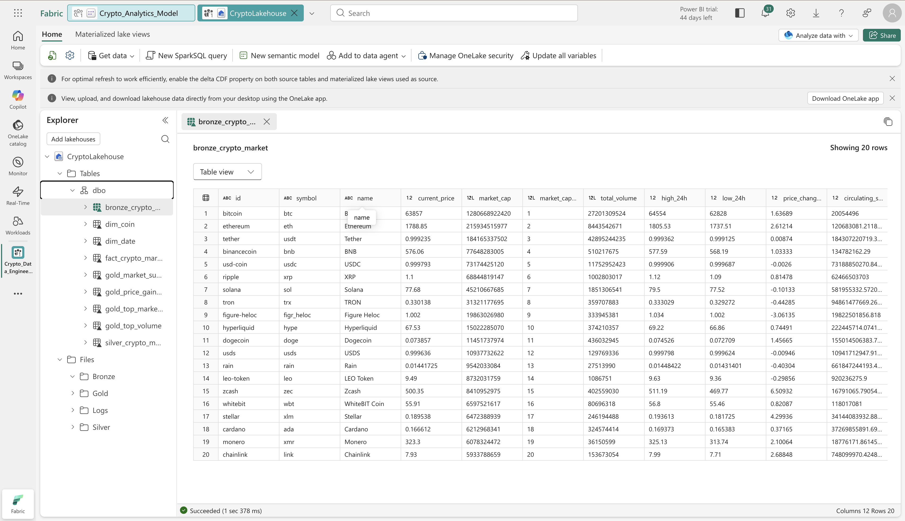
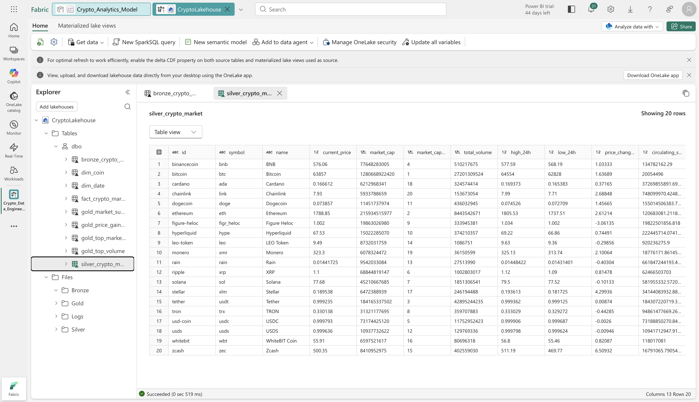
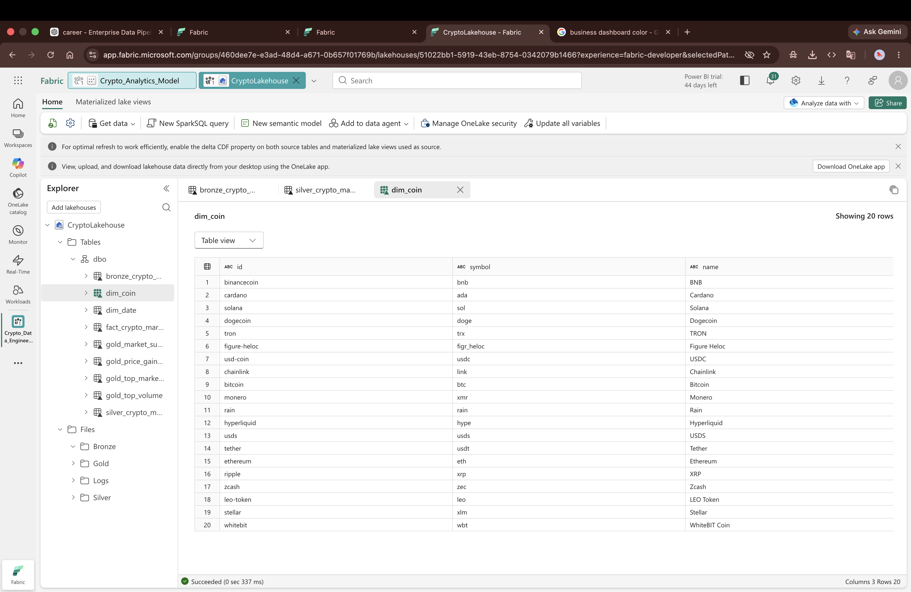
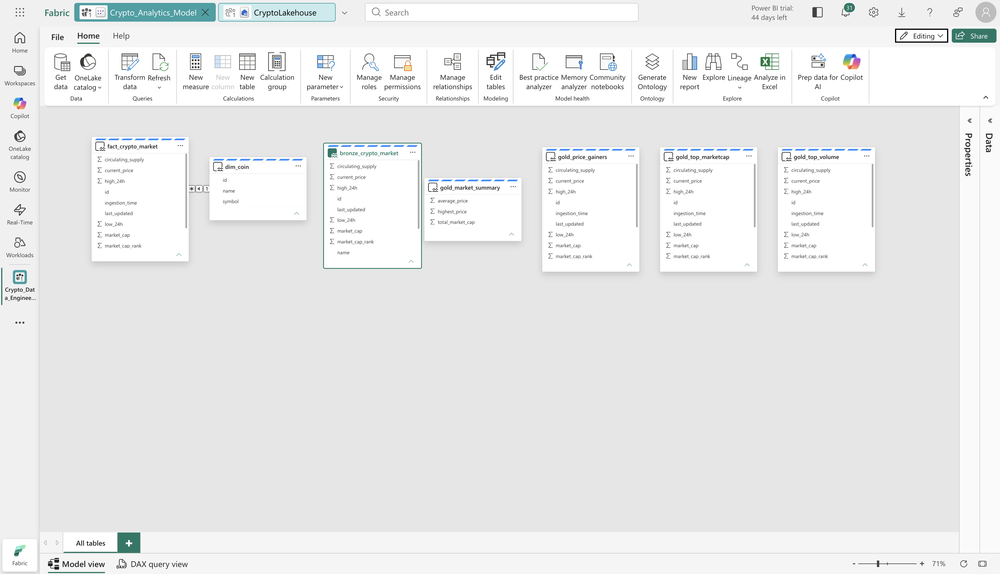
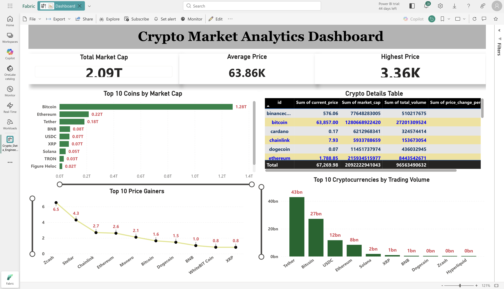

# 🚀 Enterprise Crypto Data Engineering Pipeline using Microsoft Fabric

An end-to-end Enterprise Data Engineering Pipeline built using **Microsoft Fabric** that ingests real-time cryptocurrency market data from the **CoinGecko API**, processes it through the **Medallion Architecture (Bronze, Silver, Gold)**, automates ETL using **Fabric Pipelines**, and delivers interactive analytics with **Power BI**.

---

## 📌 Project Overview

This project demonstrates a modern cloud-based data engineering workflow using Microsoft Fabric.

The pipeline performs:

- Real-time cryptocurrency data ingestion
- Data cleaning and transformation
- Medallion Architecture implementation
- Automated ETL orchestration
- Semantic Modeling
- Interactive Power BI Dashboard

---

## 🏗 Architecture



---

## ⚙️ Technology Stack

| Technology | Purpose |
|------------|----------|
| Microsoft Fabric | Data Engineering Platform |
| OneLake | Data Storage |
| Lakehouse | Data Repository |
| PySpark | Data Transformation |
| Spark SQL | Analytics |
| Fabric Pipeline | Workflow Automation |
| Semantic Model | Business Layer |
| Power BI | Dashboard & Reporting |
| CoinGecko API | Data Source |
| Python | Data Processing |

---

# 📂 Project Structure

```text
crypto-data-engineering-pipeline
│
├── architecture
│   └── Architecture.png
│
├── dashboard
│   ├── Dashboard.png
│   └── Dashboard.pbix
│
├── notebooks
│   ├── 01_API_Ingestion.ipynb
│   ├── 02_Silver_Transformation.ipynb
│   └── 03_Gold_Transformation.ipynb
│
├── pipeline
│   └── Pipeline.png
│
├── screenshots
│   ├── Bronze.png
│   ├── Silver.png
│   ├── Gold.png
│   ├── Semantic_Model.png
│   └── Dashboard.png
│
├── README.md
└── requirements.txt
```

---

# 📊 Data Pipeline

## Bronze Layer

- Extract data from CoinGecko API
- Store raw JSON data
- Preserve original schema

---

## Silver Layer

- Clean missing values
- Remove duplicates
- Standardize data types
- Create Dimension Table
- Create Fact Table

---

## Gold Layer

Business-ready tables

- Market Summary
- Top Market Cap Coins
- Top Trading Volume Coins
- Top Price Gainers

---

# 🔄 ETL Workflow

```
CoinGecko API
      │
      ▼
01_API_Ingestion
      │
      ▼
Bronze Layer
      │
      ▼
02_Silver_Transformation
      │
      ▼
Silver Layer
      │
      ▼
03_Gold_Transformation
      │
      ▼
Gold Layer
      │
      ▼
Fabric Pipeline
      │
      ▼
Semantic Model
      │
      ▼
Power BI Dashboard
```

---

# 📈 Dashboard Features

### KPI Cards

- Total Market Capitalization
- Average Coin Price
- Highest Coin Price

### Visualizations

- Top 10 Coins by Market Capitalization
- Top 10 Trading Volume
- Top 10 Price Gainers
- Cryptocurrency Details Table

---

# 📷 Screenshots

## Bronze Layer



---

## Silver Layer



---

## Gold Layer



---

## Semantic Model



---

## Dashboard



---

# 🚀 How to Run

1. Clone the repository

```bash
git clone https://github.com/YOUR_USERNAME/crypto-data-engineering-pipeline.git
```

2. Open Microsoft Fabric

3. Import the notebooks

4. Configure the CoinGecko API endpoint

5. Run notebooks in order:

- 01_API_Ingestion
- 02_Silver_Transformation
- 03_Gold_Transformation

6. Execute the Fabric Pipeline

7. Refresh the Semantic Model

8. Open the Power BI Dashboard

---

# 📌 Key Features

- End-to-End Data Engineering Pipeline
- Real-Time API Integration
- Medallion Architecture
- Lakehouse Implementation
- PySpark Transformations
- Spark SQL Analytics
- ETL Automation
- Semantic Modeling
- Interactive Power BI Dashboard
- Enterprise Data Engineering Best Practices

---

# 📚 Skills Demonstrated

- Microsoft Fabric
- Data Engineering
- ETL Pipeline Development
- PySpark
- Spark SQL
- Data Modeling
- OneLake
- Lakehouse
- Power BI
- REST API Integration
- Semantic Modeling
- Data Visualization

---

# 📄 License

This project is developed for educational and portfolio purposes.
